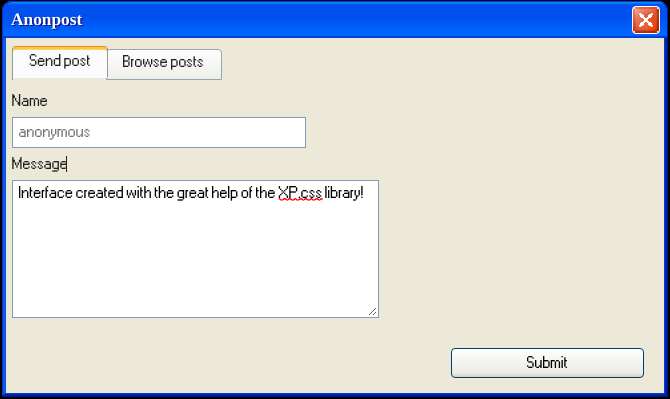

# Anonpost
<div align="center">
	
</div>

Anonpost is a really simple docker containerized web application built with the only purpose to learn more about the technologies involed. 

Unfortunately my html/css skills suck, so don't expect a friendly client experience :P

This project is heavily inspired by the docker [getting-started](https://github.com/docker/getting-started) repository.

Two containers are connected in the same virtual network interface to communicate and they implement correspondingly the front and back end. The front end is a nodejs application that utilizes [express.js](https://expressjs.com/) for handling incoming requests. It offers both a static page and APIs endpoints for interacting with the database a.k.a the second container (the APIs are used by the static pages with some fetch requests from the front end). The APIs endpoints are
- POST /send 
	Sends a new post to the database
- GET /dump
	Extracts the saved posts from the database

Every input is properly sanitized to offer a secure experience :D (I hope so..) 
```
(External user) -> localhost:3000 [frontend network]
                            |
                  +--------------------+
                  |  frontend service  |..ro.. bind mount to /app folder
                  |      "webapp"      |
                  +--------------------+
                            |
                     [backend network]
                            |
                  +--------------------+
                  |  backend service   |  r+w   ___________________
                  |  "mysql database"  |=======( persistent volume )
                  +--------------------+        \_________________/
```


## Run the application
```
docker compose up -d 
```
## Conclusion
I've learned a lot.
